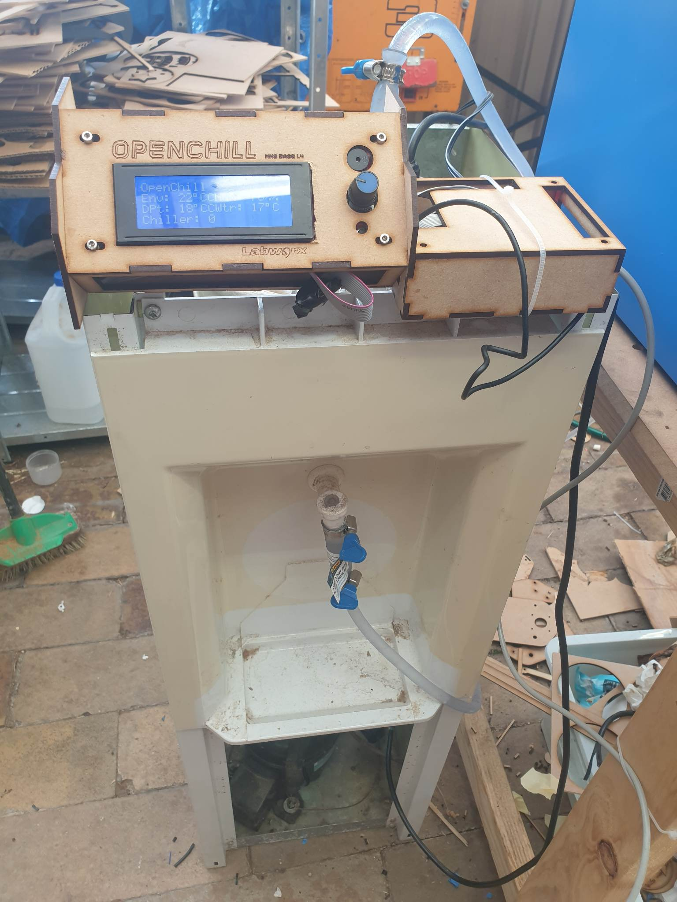
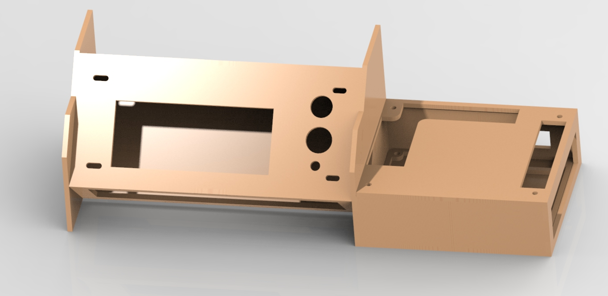

# OpenChill

OpenChill is an open source laser chiller firmware and hardware project using readily available parts from JayCar (Australia)
NOTE: You can also now install OpenChill on an MKS Base v1.4 3D Printer Control Board

## Why OpenChill?

A Co2 laser tube requires water cooling to maintain power, longevity and safety of the equipment.  The issue is, if the water can't be kept cool enough, the laser starts to lose power and over time, degrades and becomes unusable quicker.
  

Why can't we just pump icy cold water through it then using a fridge or freezer?  Well, great question, it turns out that condensation buildup on and inside the laser tube causes 'arcing' and 'shorting' which can be harmful or fatal to YOU, the operator, and your laser.

  This is where OpenChill comes into play.

 

OpenChill monitors the room's Humidity and Temperature using a sensor connected to the control board.  It then calculates the room's "dew point", which is the temperature in which the tubing will begin to generate condensation. 

 The firmware allows you to configure various settings (via wifi/web browser, and eventually a windows app), such as 'Set temperature of chiller dynamic to 3 degrees celsius ABOVE dew point', etcetera. 

 It will allow for remote monitoring and configuration, and eventually a touch screen, mounts, and more. It will also incorporate the K40 laser 'Cooler Warning' signal wire to shut the laser down incase certain conditions are met.

 

The sky is truly the limit with OpenChill and I can't wait to see the progress over time of this awesome project.

 

Images, instructions, firmware, etc all in progress of ALPHA, once ready for initial commit we can begin group collaboration.

## Parts List

Please see the BOM and Schematics PDFs -- parts won't be listed here anymore, only in the files.  All parts available from Jaycar Australia

## Non standard bits and pieces

* A water cooler with a working condensor/fridge mechanism.  We will be removing the thermostat that it has and installing OpenChill. 

## Downloads 
* OpenChill Uno Firmware
* OpenChill ESP Firmware
* OpenChill Windows Monitoring Tool
* OpenChill Enclosure Lasercut Files 

